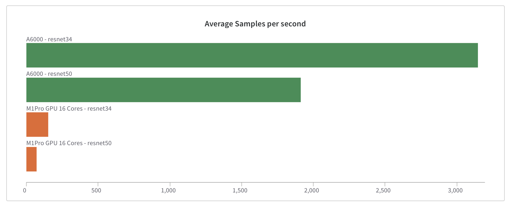
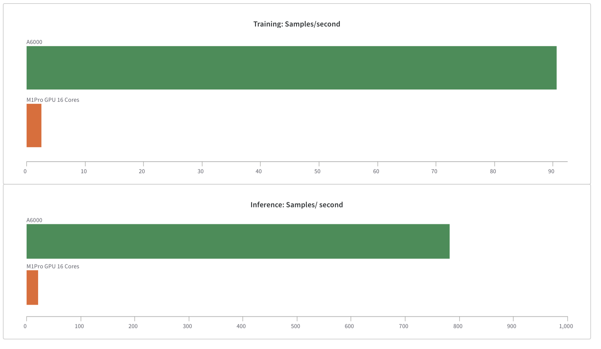

# Apple Silicon DL benchmarks

Currently we have PyTorch and Tensorflow that have Metal backend.

## Results 
Varied results across frameworks:
- [Apple M1Pro Pytorch Training Results](https://wandb.me/pytorch_m1)
- [Apple M1Pro Tensorflow Training Results](https://wandb.me/m1pro)

### Tensorflow Resnet50:

### PyTorch Resnet50:
- Difference between CPU and GPU

- Comparing with Nvidia

### PyTorch Bert
- Running a Bert from Huggingface

## Pytorch
We have official PyTorch support! check [pytorch](pytorch) folder to start running your benchmarks

## Tensorflow
You can run tensorflow benchmarks by going to the [tensorflow](tensorflow) folder.
